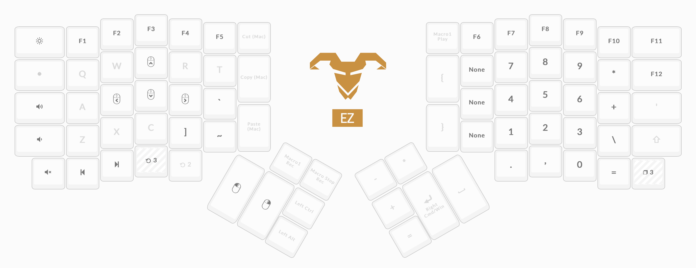

# ergodox-ez-layout
My Ergodox EZ Layout

Made with the [Ergodox Configurator](https://configure.ergodox-ez.com/ergodox-ez/layouts/XbmXx/ZPgjp/0).

## Layer 0: QWERTY

## Layer 1: Vi Keybindings by long pressing `d`

## Layer 2: Symbols and mouse

## Layer 3: F-keys and numpad

